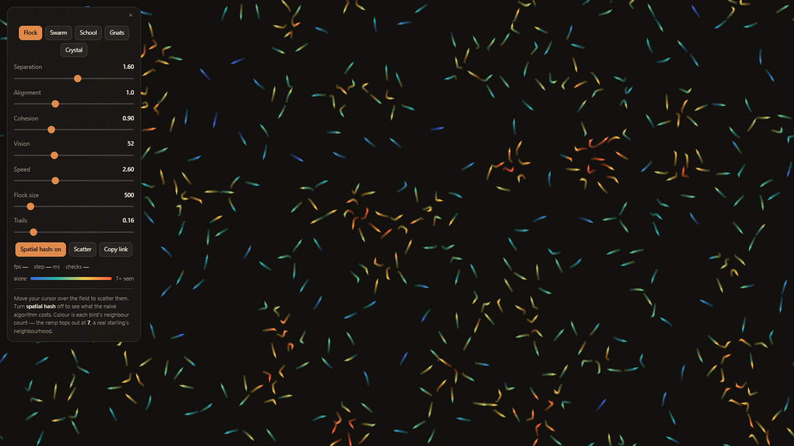
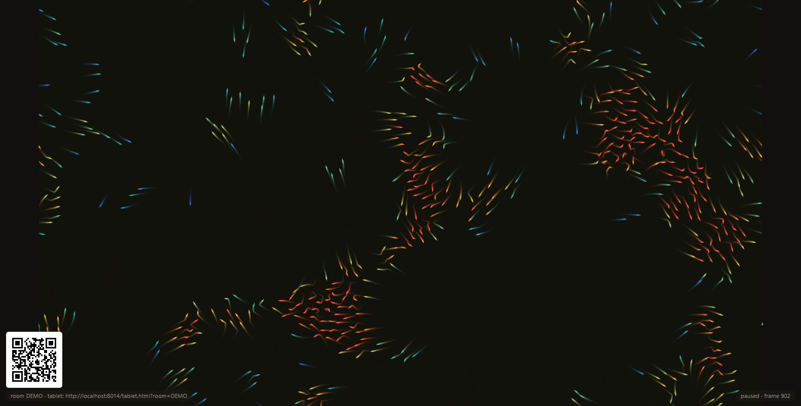
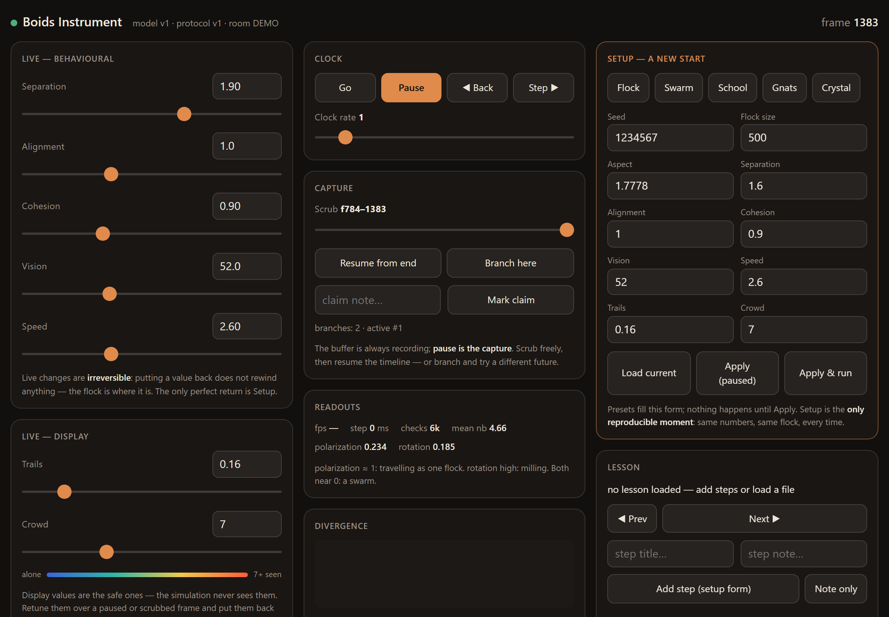
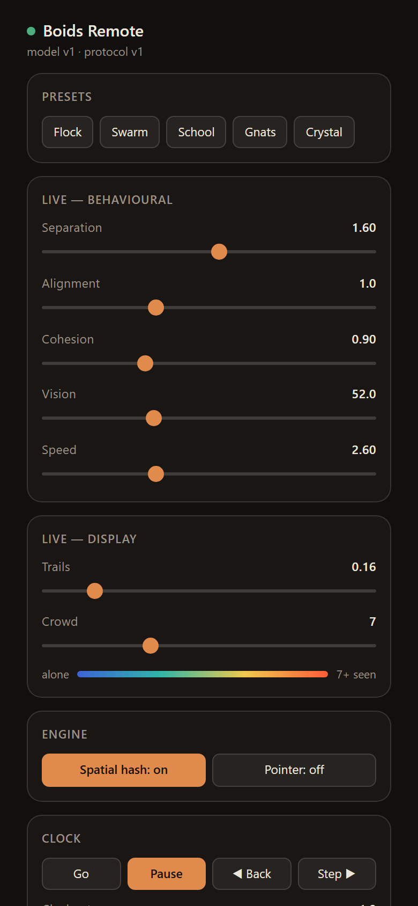
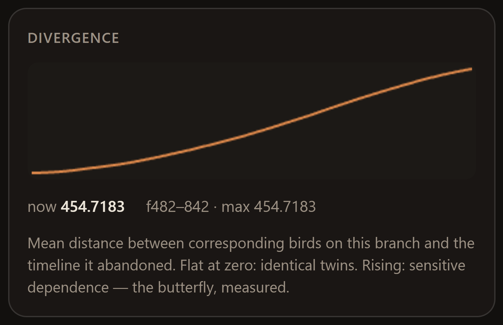

# Boids Lab

**A flock of birds for every screen in the house — and a laboratory for every
question you ask it.**

Craig Reynolds' three rules — separation, alignment, cohesion — running as
single-file web pages with zero dependencies, no build step, and no accounts.
Fly it on your TV. Steer it from your tablet. Rewind it, branch it, and measure
the butterfly effect from the couch.

**Fly it right now — nothing to install:**

- 🐦 **[The toy](https://ohthedufner.github.io/boids-lab/)** — sliders, presets,
  and 500 birds in one page.
- 🖼️ **[Ambient display](https://ohthedufner.github.io/boids-lab/model.html?autorun)** —
  just the flock, no controls. Full-screen it and let it run.
- 🎛️ **The full instrument** — open
  [model.html](https://ohthedufner.github.io/boids-lab/model.html) in one tab and
  [tablet.html](https://ohthedufner.github.io/boids-lab/tablet.html) in another.
  They find each other automatically (same browser, no server): the first tab is
  the display, the second is the control room.

## One flock, every screen

The pages are honest about what they're for, so pick per device:

| Screen | Page | What it becomes |
|---|---|---|
| 📺 TV / big display | `model.html` | The flock and nothing else — no control panel, boots paused, waits for a client (`?autorun` for ambient mode) |
| 📺 Google TV (native) | `tv_app/` | Two installable TV apps: the flock plus an embedded relay, phones pair by QR — no PC needed. See [`tv_app/README.md`](tv_app/README.md) |
| 🎛️ Tablet | `tablet.html` | The full instrument: sliders with numeric entry, clock, capture, setup, lessons, ensembles |
| 📱 Phone | `remote.html` | A pocket remote: presets, sliders, clock |
| 💻 Anything | `index.html` | The self-contained toy — the whole lab in one file |
| 👀 Anyone else's phone | any client + `?observe` | Read-only: follow the driver's moves live |

## The living-room setup

One command on any computer with [Node.js](https://nodejs.org) — a Windows
desktop works great, and there's nothing to `npm install`:

    node relay.js

That serves the site to every browser on your network and prints the URLs to
open. Put `model.html?room` on the TV's browser; whenever the flock is paused,
a **QR code** sits in the corner — scan it with a tablet or phone and you're
holding the controls. That's the whole pairing story.

No relay handy? Any static server works for a single machine
(`python -m http.server 8013`), and double-clicking `index.html` works for the
toy. The hosted site above covers the zero-install case — it just can't cross
devices, because GitHub Pages won't run the WebSocket relay.

Got a Google TV? `tv_app/` builds two **native TV apps** that carry the relay
inside them — the TV serves the remote to your phone all by itself, and the
TV's own remote drives a pop-up panel. See
[`tv_app/README.md`](tv_app/README.md).

## Things to try tonight

- **Ride the presets.** Flock, Swarm, School, Gnats, Crystal — each is a
  different personality from the same three rules.
- **Pause is a time machine.** The buffer is always recording, so pausing lets
  you scrub back through the recent past, then resume — or **branch** from any
  captured frame and try a different future.
- **Break one rule at a time.** Zero out cohesion, then alignment, then
  separation, and watch which ingredient each one was.
- **Achieve a doughnut.** Tune until the flock mills in a ring — the rotation
  readout tells you objectively when you've done it.
- **Export the run.** A whole experiment — start state, every change, every
  branch — saves as one small file that replays **bit-identically** anywhere.

<table>
<tr>
<td width="62%"></td>
<td width="38%"></td>
</tr>
<tr>
<td align="center"><code>tablet.html</code> — the control room</td>
<td align="center"><code>remote.html</code> — the pocket remote</td>
</tr>
</table>

## For the classroom and the curious

Underneath the fun is a deliberately serious design: the model has **no control
panel at all** and is driven entirely through a small published API
(`docs/instrument-protocol.md`). That buys properties a demo can't offer:

- **Determinism you can bank on.** Setup (seed, flock size, aspect) is the only
  reproducible moment; the same numbers grow the same flock, bit for bit, on
  every machine. Run files re-grow entire experiments exactly.
- **Order parameters, not vibes.** Live polarization and rotation readouts —
  the two numbers Couzin (2002) uses to separate swarm, torus, and polarized
  phases — make challenges objectively checkable (`rot > 0.7` sustained is a
  doughnut, no arguing).
- **The butterfly effect, measured.** Branch from a captured frame, nudge one
  parameter, and the divergence curve plots the mean distance between the two
  timelines' corresponding birds. An unchanged branch reads exactly zero — the
  instrument proves its own honesty.

  

- **Ensembles.** The same setup across many seeds, order parameters tabulated —
  the difference between an anecdote and a distribution.
- **Lessons and observers.** Build an ordered list of starts with talking
  points, advance it from the tablet, and let a roomful of phones follow along
  read-only (`?observe`).
- **Sourced provenance.** The history docs trace every knob to Reynolds, Aoki,
  Vicsek, Couzin, or STARFLAG — and say plainly which knobs have no ancestor.

Clients build their interfaces from the model's published `spec`, so the
protocol is also an invitation: anything that can open a WebSocket can drive
the flock. The tests drive it with no browser at all.

## The toy

`index.html` is where it started: one file, one flock, seven sliders, five
presets, a spatial-hash toggle with a live cost counter, and a permalink that
encodes the whole state. It's kept as a conscious fork of the model — frozen,
simple, and ideal for tinkering.

Colours live in one clearly-marked block near the top of its script
(`---- colour ----`):

- **`STOPS`** — the ramp from *alone* to *crowded*, currently blue `#3D63D8` →
  teal `#2FB6A8` → yellow `#EFC94C` → hot orange `#FF5C38`. Edit freely; any
  number of stops works, and the panel's legend strip repaints itself from your
  edits.
- **`CROWD`** — the neighbour count where the ramp saturates. Set to **7**,
  which is a citation, not a taste: real starlings attend to their 6–7 nearest
  neighbours (Ballerini et al., PNAS 2008 — the STARFLAG project). A fully hot
  bird is seeing a real starling's neighbourhood.

## Tests

    node test/protocol-test.js     # 40 checks: contract, determinism, capture, run files, divergence
    node test/ws-test.js           # 12 checks: real relay, real WebSockets, room isolation
    node test/tv-relay-test.js     # the TV apps' embedded Java relay passes the same suite (needs a JDK)
    cd test && npm install && node qr-test.js    # QR decode round-trip (skips without jsqr)

See `test/README.md` for what each covers and hard-won notes for future test
authors.

## Reading

- `docs/driving-the-instrument.md` — **start here to use the tablet**: the
  field guide for whoever is holding it, including living-room setup and five
  things to try tonight.
- `docs/instrument-protocol.md` — the contract between every page; build your
  own client from this.
- `docs/instrumenting-the-flock.md` — why the model publishes an API instead of
  owning a control panel.
- `docs/boids-panel-stories.md` — the museum-placard prose for every control.
- `docs/boids-history-and-provenance.md` — the sourced history of every knob.
- [Reynolds' boids page](https://www.red3d.com/cwr/boids/) ·
  [the 1987 paper](https://www.cs.toronto.edu/~dt/siggraph97-course/cwr87/)

---

MIT licensed. Screenshots in `docs/media/` are the real pages, captured from a
running session.
