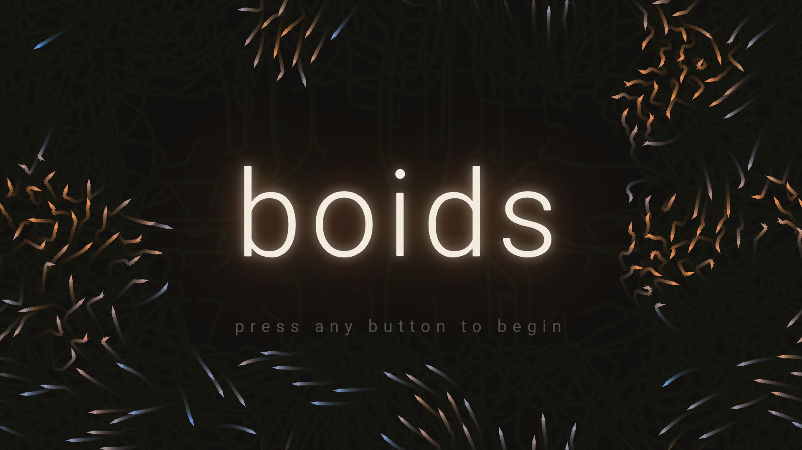
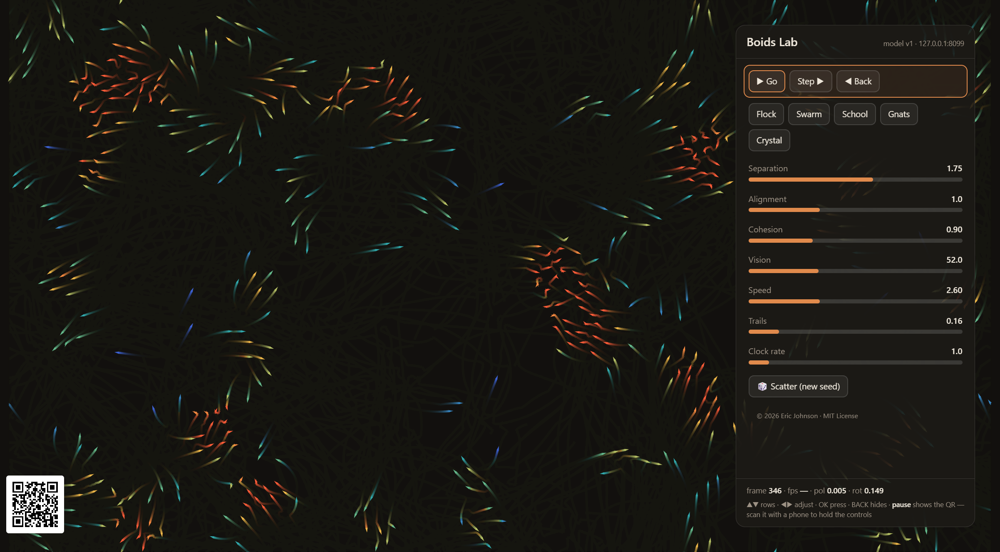
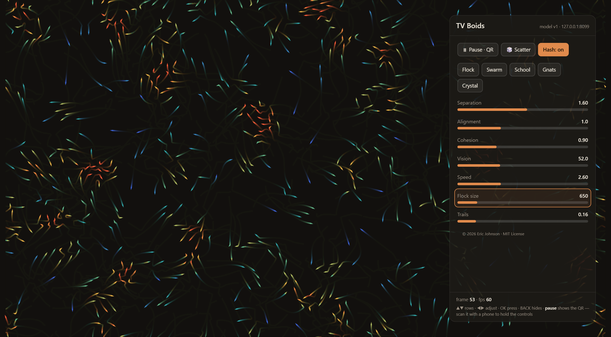

# Boids on Google TV

Two native TV apps built from the pages in this repo. Each one is a fullscreen
WebView showing `model.html`, plus an embedded copy of the relay (a Java port
of `relay.js`) that serves the control pages to every phone on your network —
no PC, no Node, nothing else running.

| App | On the TV | On your phone |
|---|---|---|
| **Boids Lab** (`lab/`) | The flock + a D-pad panel: clock, presets, live sliders | `tablet.html` — the full instrument |
| **TV Boids** (`boids/`) | The flock + a D-pad panel with the original toy's controls | `remote-lite.html` — presets, 7 sliders, scatter |

Neither app has onscreen controls in the way: the panel only appears when you
press a button on the TV remote, and slides away on its own.

Launching either app opens with the word **boids** growing in from a
distance, its glow acting as an invisible border the flock refuses to cross
— press any button to begin (or don't: it begins on its own after a while,
so ambient mode works unattended).

## Build it

Open `tv_app/` in Android Studio and press Build, or from a terminal:

    cd tv_app
    gradlew assembleDebug        (gradlew.bat on Windows)

APKs land in `lab/build/outputs/apk/debug/lab-debug.apk` and
`boids/build/outputs/apk/debug/boids-debug.apk`. Each is under 1 MB.

## Load it onto the TV

**One-time TV setup:** Settings → System → About → click **Android TV OS
build** seven times ("You are now a developer!"), then Settings → System →
Developer options → turn on **USB debugging** (and **Wireless debugging** if
your TV lists it). Find the TV's IP under Settings → Network & Internet →
your network.

**From this computer** (adb ships with Android Studio, in
`<sdk>/platform-tools/`):

    adb connect <tv-ip>:5555      # accept the prompt on the TV the first time
    adb install lab/build/outputs/apk/debug/lab-debug.apk
    adb install boids/build/outputs/apk/debug/boids-debug.apk

**No adb?** Copy the APK to Google Drive or a USB stick, install a file
manager on the TV (e.g. "FX File Explorer" from the TV's Play Store), open
the APK from it, and allow "install unknown apps" when asked.

Both apps appear in the TV's **Your apps** row — "Boids Lab" and "TV Boids",
each with a flock on its banner.

## Find and use the remote

**The TV remote is a remote.** Press any button and the control panel slides
in; it hides again after 20 seconds, or press **BACK**.

- **▲ ▼** move between rows
- **◀ ▶** drag the focused slider, or move along a row of buttons
- **OK** presses the focused button
- **play/pause** on the remote always toggles the flock, panel or no panel

**Your phone is the better remote.** Pause the flock (OK, then OK again on
the highlighted Pause button) and a **QR code appears bottom-left** — that's
the pairing story, same as the rest of this repo. Scan it and your phone is
holding the controls: the full instrument for Boids Lab, the lite remote for
TV Boids. Or just browse to `http://<tv-ip>:8014/` from anything on your
network — the TV serves the remote itself, already paired (the panel's
header shows the exact address). The room code is minted once per install,
so a bookmark keeps working across restarts. The panel's © line opens the
MIT license.

Phones follow the TV and the TV panel follows phones — the model is the
single source of truth, so every screen always agrees.

## If the phone can't connect

Phone and TV must be on the same network, and your router must allow devices
to talk to each other (guest networks often isolate them — that's the usual
culprit). The flock itself never needs the network; only pairing does.

## Under the hood

The activity starts `RelayServer` (shared/src — the same protocol relay as
`relay.js`, ported to zero-dependency Java) on port 8014, then loads
`tv.html` **via the TV's own LAN address**, so the QR the model draws is a
URL other devices can actually reach. `tv.html` frames the model and drives
it over the instrument protocol, exactly like any other client — see
`docs/instrument-protocol.md`. The embedded relay passes the same test suite
as `relay.js`:

    node test/tv-relay-test.js
